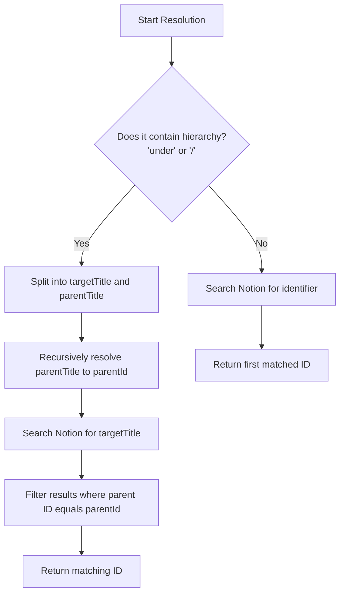

# Design: Notion Page Resolution by Title & Hierarchy

## 1. Overview

Currently, Puding's Notion tools require the user/AI to specify exact 32-character hexadecimal `page_id` or `parent_id` strings (e.g., `create_notion_page(parent_id: "...")`). During natural voice or text conversations, users refer to pages by their human-readable names or paths, such as:
- *"Please read the Music page"*
- *"Append a note to the Busking List page under Music"*
- *"Create a page named Grocery List under Shopping"*

To support this, we will upgrade `NotionService` to accept queries containing page titles and hierarchical relationships (e.g. using "under" or "/") and dynamically resolve them to Notion Page IDs on the backend using the Notion Search API.

**Key updates based on feedback:**
1. Assume the input will always be a human-readable title or path (no UUID checks).
2. Remove all mock/dry-run capabilities; Notion Service operates exclusively with a valid Notion client.

---

## 2. Proposed Abstraction & Resolution Algorithm

We will implement a page resolution engine within `NotionService` that parses natural language identifiers and resolves them to exact Notion IDs.

### 2.1 Identifier Formats Supported
1. **Simple Title:** E.g., `"Music"`. Matches pages or databases named "Music".
2. **Hierarchical Title (Child under Parent):**
   - **`"Child Page under Parent Page"`**: E.g., `"Busking List under Music"`.
   - **`"Parent Page/Child Page"`**: E.g., `"Music/Busking List"`.

### 2.2 Resolution Logic

We will introduce a recursive helper `resolveId(identifier: string): Promise<string>`:



---

## 3. Detailed Implementation Plan

### 3.1 Service Update (`notion.service.ts`)

Add the following helper methods to `NotionService`:

```typescript
/**
 * Resolves a human-readable identifier to a Notion Page/Database ID.
 */
public async resolveId(identifier: string): Promise<string> {
  const cleanId = identifier.trim();

  // 1. Parse hierarchy
  let targetTitle = cleanId;
  let parentTitle: string | undefined;

  if (cleanId.toLowerCase().includes(" under ")) {
    const index = cleanId.toLowerCase().indexOf(" under ");
    targetTitle = cleanId.substring(0, index).trim();
    parentTitle = cleanId.substring(index + 7).trim();
  } else if (cleanId.includes("/")) {
    const parts = cleanId.split("/");
    parentTitle = parts[0].trim();
    targetTitle = parts[1].trim();
  }

  // 2. Recursive Resolution
  if (parentTitle) {
    const parentId = await this.resolveId(parentTitle);
    
    // Search matching target titles
    const searchResponse = await this.client.search({ query: targetTitle });
    
    for (const result of searchResponse.results as any[]) {
      // Extract title based on object type
      const resultTitle = this.extractTitle(result);
      if (resultTitle.toLowerCase() === targetTitle.toLowerCase()) {
        const resultParentId = result.parent?.page_id || result.parent?.database_id;
        if (resultParentId === parentId) {
          return result.id;
        }
      }
    }
    
    throw new Error(`Could not find page "${targetTitle}" under parent "${parentTitle}".`);
  } else {
    // Search matching target title
    const searchResponse = await this.client.search({ query: targetTitle });
    if (searchResponse.results.length === 0) {
      throw new Error(`Could not find Notion page or database matching: "${targetTitle}"`);
    }

    // Try exact match first
    for (const result of searchResponse.results as any[]) {
      const resultTitle = this.extractTitle(result);
      if (resultTitle.toLowerCase() === targetTitle.toLowerCase()) {
        return result.id;
      }
    }

    // Fallback to first search result
    return searchResponse.results[0].id;
  }
}

/**
 * Extracts the title text from a page or database object.
 */
private extractTitle(result: any): string {
  if (result.object === "database") {
    return result.title?.[0]?.plain_text || "Untitled Database";
  } else if (result.object === "page") {
    const titleProp = Object.values(result.properties).find((p: any) => p.type === "title") as any;
    return titleProp?.title?.[0]?.plain_text || "Untitled Page";
  }
  return "Untitled";
}
```

### 3.2 Tool Schemas Update

We will update the tool definitions in [gemini.session.ts](file:///Users/ofekshlinger/Development/puding/apps/server/src/gemini/gemini.session.ts) to rename the input arguments and update descriptions. This instructs Gemini to supply titles or paths (e.g. `"Music"`, `"Busking List under Music"`) instead of IDs:

- `read_notion_page`:
  - Parameter: `page_identifier: string` (description: *"The Notion page title or path, e.g. 'Music' or 'Busking List under Music'."*)
- `create_notion_page`:
  - Parameter: `parent_identifier: string` (description: *"The parent page title or path under which to create the new page, e.g. 'Music'."*)
  - Parameter: `title: string`
  - Parameter: `content: string`
- `write_notion_page`:
  - Parameter: `page_identifier: string` (description: *"The Notion Page title or path to write content to, e.g. 'Music/Busking List'."*)
  - Parameter: `content: string`

### 3.3 Tool Execution Loop Update

In `GeminiSession.handleToolCall`, resolve the identifiers to IDs before invoking Notion actions:

```typescript
if (call.name === "read_notion_page") {
  const pageId = await this.notionService.resolveId(call.args.page_identifier);
  output = await this.notionService.readPage(pageId);
} else if (call.name === "create_notion_page") {
  const parentId = await this.notionService.resolveId(call.args.parent_identifier);
  output = await this.notionService.createPage(
    parentId,
    call.args.title,
    call.args.content || "",
  );
  // Send client card...
} else if (call.name === "write_notion_page") {
  const pageId = await this.notionService.resolveId(call.args.page_identifier);
  output = await this.notionService.writePage(
    pageId,
    call.args.content,
  );
  // Send client card...
}
```

---

## 4. Verification Plan

1. **Unit Tests:** Add unit tests to `notion.service.spec.ts` mocking the Notion `search` endpoint to verify:
   - Simple title resolution.
   - Hierarchical resolution (searching matching child with parent ID).
2. **Build verification:** Run `pnpm run build` and `pnpm test` to verify zero compile or runtime test failures.
